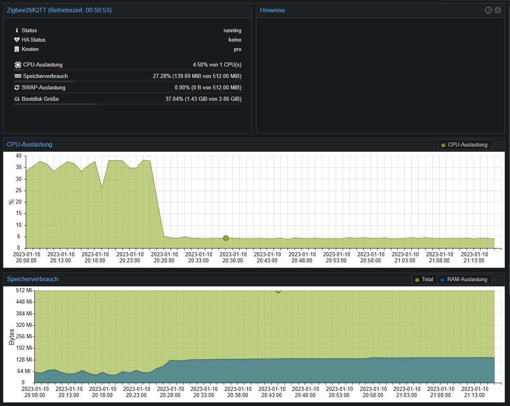

Ein Anleitung/Erfahrungsbericht vom User [Acgua](https://github.com/Acgua):

Ich bin umgestiegen vom Zigbee-Adapter, mit 30+ Geräten, ConBee II Stick.
Meine Vorgehensweise für Proxmox-Container in etwa:

### Proxmox-Container vorbereiten:

-   Debian 11 Container erstellt: 512 MB RAM, 512 MB Swap, 4 GB HD-Speicher, 1 Kern
-   `apt update -y && apt upgrade -y`, `apt install -y sudo usbutils curl git` (und ggf. paar mehr benötigte Pakete)
-   `adduser z2m`, `adduser z2m sudo`, `su z2m` (ab jetzt nur noch User `z2m` nehmen, nicht mehr root)
-   USB-Stick (ConBee II) durchreichen gemäß [ioBroker-Doku](https://github.com/ioBroker/ioBroker.docs/blob/master/docs/de/install/proxmox.md#proxmox---lxc-linux-containers---usb-ger%C3%A4te-durchreichen)

### Mosquitto in Container installieren:

(angelehnt an [diese Anleitung](https://randomnerdtutorials.com/how-to-install-mosquitto-broker-on-raspberry-pi/))

-   `sudo apt install -y mosquitto mosquitto-clients`
-   Auto-Start einrichten: `sudo systemctl enable mosquitto.service`
-   Enable Remote Access (No Authentication): `sudo nano /etc/mosquitto/mosquitto.conf` und die Zeilen `listener 1883` und `allow_anonymous true` am Ende der Datei eintragen. (Notiz an mich selbst: auf auth umstellen!)
-   Mosquitto neu starten: `sudo systemctl restart mosquitto`
-   Status prüfen: `systemctl status mosquitto`
-   `sudo reboot`, dann mit `systemctl status mosquitto` prüfen, ob Mosquitto automatisch startet.

### Zigbee2MQTT in Container installieren:

-   Vorgehensweise in etwa gemäß der [offiziellen Anleitung für Linux](https://www.zigbee2mqtt.io/guide/installation/01_linux.html). **Wichtig:** gemäß Anleitung wird NodeJS 16 installiert (`...setup_16.x`), ich habe das auf 18 geändert (wird offiziell supportet)
-   Konfiguration in `/opt/zigbee2mqtt/data/configuration.yaml` nach Anleitung gemacht, dabei als MQTT Server `server: 'mqtt://localhost'` eingetragen
-   Eingerichtet, dass Zigbee2MQTT automatisch beim Booten startet [gemäß Doku](https://www.zigbee2mqtt.io/guide/installation/01_linux.html#optional-running-as-a-daemon-with-systemctl).
-   `sudo reboot`, dann mit `systemctl status zigbee2mqtt.service` prüfen, ob Zigbee2MQTT automatisch startet.

### ioBroker Zigbee2MQTT-Adapter

-   Vorgehensweise gemäß Doku - [Installation inkl. Umzug vom ioBroker/Zigbee Adapter](https://github.com/o0shojo0o/ioBroker.zigbee2mqtt/blob/main/docs/DE/DE_get-started_move.md)
-   **Wichtig, falls ConBee II Stick**: `configuration.yaml` nochmal anpassen:
    1.  Unter `serial` eintragen: `adapter: deconz`
    2.  Unter `advanced` die Zeile `transmit_power: 20` löschen, das scheint der ConBee II nicht zu können und es kommen Fehler beim Start von Zigbee2MQTT

### Screenshots

Proxmox (letzter Neustart war erst vor 50 Minuten). Schön geringer Ressourcenbedarf.

