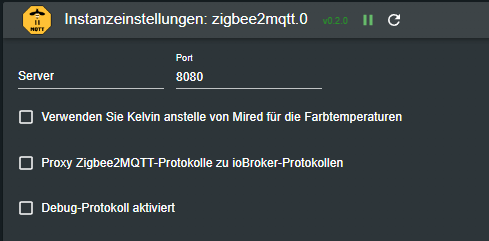

# Installation inkl. Umzug vom ioBroker/Zigbee Adapter

Die Installation des Adapters sowie den Umzug des ioBrocker/Zigbee Adapters erfordert einige Vorarbeiten. 
Hier wird die grundlegende Installation und deren Voraussetzungen beschrieben. Detaillierte Informationen, Anleitungen und Einstellungen findet ihr auf der Seite von [Zigbee2MQTT](https://www.zigbee2mqtt.io/guide/getting-started/).

## Installation

In unserem Beispiel wird Zigbee2MQTT via Docker / Docker Compose eingerichtet. Weitere Einrichtungsmethoden findet ihr auf der offiziellen Dokumentation.
Als Voraussetzung ist hier eine eingereichtete Docker Server Umgebung!

1. Die vorhandene oder neue Docker-Compose.yml bearbeiten und um folgenden Eintrag ergänzen.
   Wichtig ist , dass diese Einstellungen an eure Umgebung angepasst werden, z.B. der Pfad zur USB Antenne unter "devices" oder der Pfad zur Konfigurationsdatei unter "volumes".

    ```yml
    zigbee2mqtt:
        container_name: zigbee2mqtt
        restart: unless-stopped
        image: koenkk/zigbee2mqtt
        ports:
        - 8080:8080
        devices:
        - /dev/ttyUSB0:/dev/ttyUSB0
        volumes:
        - /etc/localtime:/etc/localtime:ro
        - ./zigbee2mqtt/data:/app/data
        environment:
        - TZ=Europe/Berlin
    ```

2. Als Nächstes sollte eine Standardkonfiguration gebaut werden.
   Hier kann die Offizielle oder die für den ioBroker Optimierte Version genommen werden.
   Dazu unter ./zigbee2mqtt/data/ die Datei configuration.yaml anlegen.
   
   Originale Konfiguration:

   ```yml
   # Let new devices join our zigbee network
   permit_join: true
   # Docker-Compose makes the MQTT-Server available using "mqtt" hostname
   mqtt:
      base_topic: zigbee2mqtt
      server: mqtt://Your Data:Your Port (im normall Fall lautet der Port : 1885)
   # Zigbee Adapter path
   serial:
      port: /dev/ttyUSB0
   # Enable the Zigbee2MQTT frontend
   frontend:
      port: 8080
   advanced:
      pan_id: Your Data
      ext_pan_id: Your Data
      channel: Your Data
      network_key: Your Data
   ```

   Für den Adapter **optimierte und empfohlene** Version - Werte mit "Your Data" müssen dabei an euere Umgebung angepasst werden.

   ```yml
   homeassistant: false
   permit_join: true
   frontend:
      port: 8080
      host: 0.0.0.0
   mqtt:
      base_topic: zigbee2mqtt
      server: mqtt://Your Data:Your Port (im normall Fall lautet der Port : 1885)
   serial:
      port: /dev/ttyACM0
   advanced:
      pan_id: Your Data
      ext_pan_id: Your Data
      channel: Your Data
      network_key: Your Data
      last_seen: ISO_8601_local
      homeassistant_legacy_entity_attributes: false
      legacy_api: false
      legacy_availability_payload: false
      output: json
      transmit_power: 20
      log_level: warn
   device_options:
      legacy: false
   availability: true
   ```
    Hier ein Beispiel aus der Konfiguration des Zigbee Adapters im ioBroker und wie diese Umgeändert eingetragen werden muss:

   

   ```yml
   mqtt:
      base_topic: zigbee2mqtt
      server: mqtt://192.168.1.1:1885 # ioBroker IP-Adresse mit MQTT Adapter oder MQTT Server siehe Zigbee2MQTT Doku
   Serial:
      port: /dev/ttyACM0 #Pfad zur Zigbee Antenne
   advanced:
      pan_id: 0x1A2C #PAN ID aus dem ioBroker konvertiert zu Hex
      ext_pan_id: [0x00, 0x12, 0x4b, 0x02, 0x37, 0xb9, 0x88] #erweiterte PAN ID aus dem ioBroker und in der Schreibweise [0xDD, 0xDD, 0xDD, 0xDD, 0xDD, 0xDD, 0xDD, 0xDD]
      channel: 15 #Kanal aus dem ioBroker
      network_key: [0x02, 0x03, 0x05, 0x08, 0x09, 0x0B, 0x0D, 0x0B, 0x00, 0x02, 0x04, 0x07, 0x08, 0x0A, 0x0C, 0x0D] # Netzwerkkey/Transportschlüssel und in der schreibweise [0xDD, 0xDD, 0xDD, 0xDD, 0xDD, 0xDD, 0xDD, 0xDD]
   ```
   Dabei ist zu bedachten, dass NUR DIE PAN_ID ins HEX Format überführt werden muss
   behilflich ist ein Hex Konverter wie  dieser : https://www.rapidtables.com/convert/number/hex-to-decimal.html.
   
   Die Restlichen Werten liegen schon im richtigen Format, müssen nur in die richtige Schreibweise überführt werden.     
   - also aus ext_pan_id: 
   `00124b0237b988`     
   - wird die ext_pan_id: 
   `0x00`, `0x12`, `0x4b`, `0x02`, `0x37`, `0xb9`, `0x88`
   
   genau so muss auch der network_key umgeschlüsselt werden.
   
   Das ist wichtig da sonst bei falsch Konfiguration der Coordinator falsche Daten bekommt und ihr das Netz nicht wieder einfach "so" aufgebaut bekommt.

3. Wie zu sehen ist, wird ein MQTT Server benötigt, dieser übernimmt aktuell für diesen Adapter keine Funktion, wird aber zum Starten benötigt.
   Dazu kann im Adapter in ioBroker einer konfiguriert werden oder wie in der Originalen Doku ein zusätzlicher Docker Container (https://www.zigbee2mqtt.io/guide/getting-started/#_2-setup-and-start-zigbee2mqtt) genutzt werden.

4. Jetzt müsst ihr mit dem Umzugsvorbereitungen beginnen. Dazu geht ihr bitte wie folgt vor:
   - Löschen aller Gruppen im aktuellen Zigbee Adpter. Diese führen leider zu div. Fehlern beim import der Datenbank. Wenn diese hier nicht raus genommen werden müssen sie aus der Datenbank manuell gelöscht werden. Dies ist aufwendig und bei Fehlern ist die Datenbank korrupt. Ein löschen dieser Gruppen in Zigbee2MQTT ist leider nicht möglich.
   - ioBroker/Zigbee Adpater stoppen
   - Die Datenbank aus dem ioBroker in den Container kopieren und umbennen. 
   Quelle: /opt/iobroker/iobroker-data/zigbee_/shepart.db
   Ziel: "Docker-Verzeichnis"/zigbee2mqtt/data/database.db

5. Habt ihr das alles erledigt, dann kann mit `docker-compose up -d` die Docker Konfiguration übernommen und der Container gestaltet werden.
   Nach einer kurzen Zeit können wir uns dann mit http://Dockerhost-IP:8080, mit dem Webinterface von Zigbee2MQTT verbinden. Auch sollte sich nun die Konfiguration geändert haben und die Hex Werte die wir eingetragen haben müssten umgerechnet worden sein. Sollte das Webinterface nicht hoch kommen/erreichbar sein liegt noch ein Fehler vor und wird zu 99% im Log des Containers angezeigt.

6. Installation des Zigbee2MQTT Adapters über den Adapter Tab im ioBroker

7. Konfiguration des Adapters
   - Zigbee2MQTT Verbindung auswählen = Empfohlene Einstellung "Websocket"
   - Websocket IP-Adresse = IP oder DNS Name des Zigbee2MQTT Servers (in unserem Falle die IP des Docker Host)
   - Websocket Port = 8080 Ist der Standard Port, wenn dieser in der Config von Zigbee2MQTT geändert, wird muss der hier auch geändert werden
   - Dummy MQTT-Server für Zigbee2MQTT erstellen = Da wir ja für Zigbee2MQTT einen MQTT Server brauchen können wir diesen Harken setzten dann haben wir die Möglichkeit einen solchen hier im Adapter zu erstellen
   - MQTT-Server IP-Adresse binden/MQTT-Server-Port = diese Einstellungen tauchen nur auf, wenn wir den Harken für den Dummy MQTT Server gesetzt haben. Sollte auf dem ioBroker kein weiter MQTT Server vorhanden sein, können wir die Standardeinstellungen so belassen, andernfalls muss mindestens der Port geändert werden.  Diese Einstellungen sollten dann auch in der Config von Zigbee2MQTT hinterlegt werden.
   - Konfiguration der Zigbee2MQTT Web UI Verbindung Konfiguration = Hier kann die Verbindung konfiguriert werden, wie die Zigbee2MQTT Web UI in den ioBroker eingebunden werden soll. Wichtig ist Wird der ioBroker via HTTPS aufgerufen, muss auch hier eine Verbindung via HTTPS aufgebaut werden. Ansonsten kommt es zu dem Fehler: (https://github.com/o0shojo0o/ioBroker.zigbee2mqtt/issues/12)
   - Farbtemperatur mit Farbe synchronisieren = Diese Einstellung sorgt dafür, dass z.b. in einer VIS wie Lovelace sich die Farbe der Lampe zur eingestellten Farbe ändert.
   - Verwende Kelvin Werte anstelle von Mired = Einstellung der Einheit für Farbtemperaturen für z.B. Lampen
   - Proxy Zigbee2MQTT Protokolle zu ioBroker Protokolle = Übernimmt die Protokolle aus Zigbee2MQTT in das ioBroker Log 
   



8. Wenn jetzt alles gut gegangen ist, haben wir unsere Zigbee Netzwerk erfolgreich umgestellt und wir können noch ein paar anpassungen machen an dem neuen System.
   - Gelöschte Gruppen wieder anlegen
   - Geräte mit einem Namen versehen
   - und zu guter letzt noch alle Skripte und Sonstige Adapter anpassen die auf gewisse States angewisen sind aus dem Zigbee Netzwerkes.
