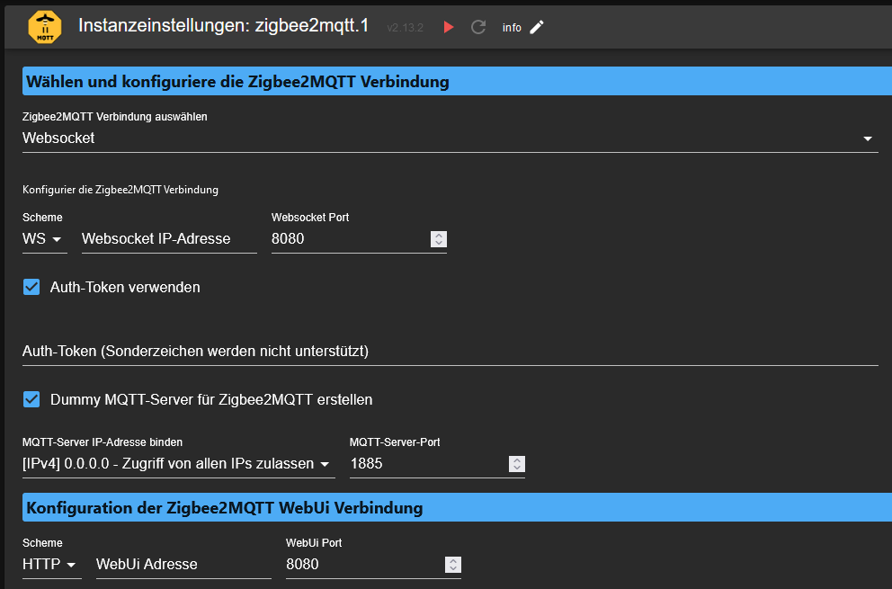
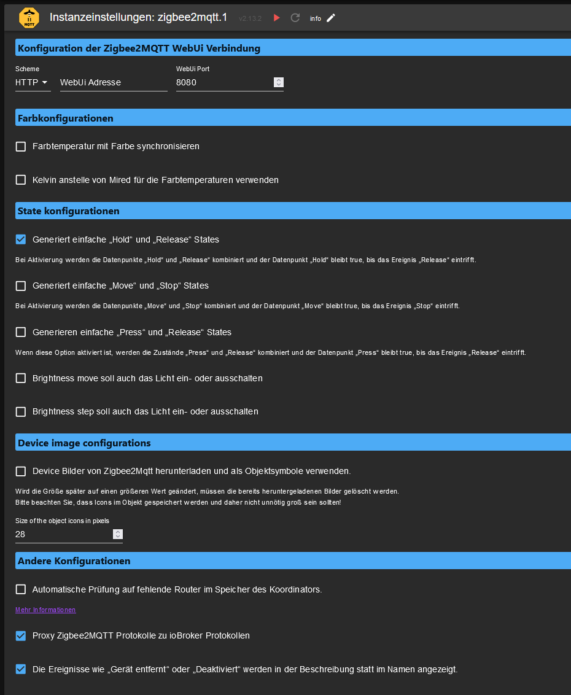

### Configuration of the adapter
| Option | Value/Description |
|--|--|
|**Select and configure Zigbee2MQTT connection**|
|Select Zigbee2MQTT connection |Recommended setting "Websocket" |
|Scheme|Select between Websocket (WS) via HTTP or HTTPS (WS SSL)|
|Websocket IP address |IP or DNS name of the Zigbee2MQTT server (in our case the IP of the Docker host)|
| Websocket Port | 8080 Is the default port, if this is changed in the config of Zigbee2MQTT, it must be changed here as well.
| Use Auth-Token|Enable to store an Auth-Token/Password to the configuration page. !!! ATTENTION !!! Special characters are not supported. More info at [Zigbee2MQTT](https://www.zigbee2mqtt.io/guide/configuration/frontend.html#advanced-configuration)|
 |Create dummy MQTT server for Zigbee2MQTT | Because we need a MQTT server for Zigbee2MQTT we can set this checkmark then we have the possibility to create one here in the adapter.
|Bind MQTT server IP address/MQTT server port  | These settings only appear if we have set the checkmark for the dummy MQTT server. If there is no other MQTT server on the ioBroker, we can leave the default settings as they are, otherwise we have to change at least the port. These settings should then also be stored in the config of Zigbee2MQTT.|
|Configuration of the Zigbee2MQTT Web UI connection Configuration|Here the connection can be configured, how the Zigbee2MQTT Web UI should be integrated into the ioBroker. It is important to note: If the ioBroker is called via HTTPS, a connection via HTTPS must also be established here. Otherwise the following error will occur: (https://github.com/o0shojo0o/ioBroker.zigbee2mqtt/issues/12)
|**Configuration of the Zigbee2MQTT WebUi connection**|
|Synchronize color temperature with color | This setting ensures that e.g. in a VIS like Lovelace the color of the lamp changes to the set color.
|Use Kelvin values instead of Mired | Setting the unit for color temperatures for e.g. lamps
|**State configurations**|
| Generates simple Hold and Release states|On activation, the Hold and Release data points are combined and the Hold data point remains true until the Release event occurs.
| Generates simple "Move" and "Stop" states|On activation, the data points "Move" and "Stop" are combined and the data point "Move" remains true until the event "Stop" arrives.
| Generate simple "Press" and "Release" states|If enabled, the "Press" and "Release" states are combined and the "Press" datapoint remains true until the "Release" event arrives.|
| Brightness move should also turn the light on or off| If enabled, when the brightness has reached 0 via Brightness move, the lamp will be turned off. And when the lamp is off, it will be switched on again.
| Brightness step should also switch the light on or off | When activated, when the brightness via Brightness step has reached 0, the lamp is switched off. And when the lamp is off it will be switched on again.|
|**Device image configurations**|
|Download device images from Zigbee2Mqtt and use them as object icons | With this setting the preview image of zigbee2MQTT is downloaded, compressed and then stored in the corresponding object. ATTENTION the first start after setting this setting takes longer depending on the number of devices.
|Size of the object icons in pixels|Sizes of the images, 28 is the default here. You should make them bigger only at your own risk. |
|**Other configurations**|
|Automatic check for missing routers in the coordinator's memory. |This option checks all devices that could theoretically be routers of the Zigbee network and lists all that are not. More information can be found at https://www.zigbee2mqtt.io/guide/usage/mqtt_topics_and_messages.html#zigbee2mqtt-bridge-request-coordinator-check |
| Proxy Zigbee2MQTT logs to ioBroker logs | Takes logs from Zigbee2MQTT to ioBroker log|

