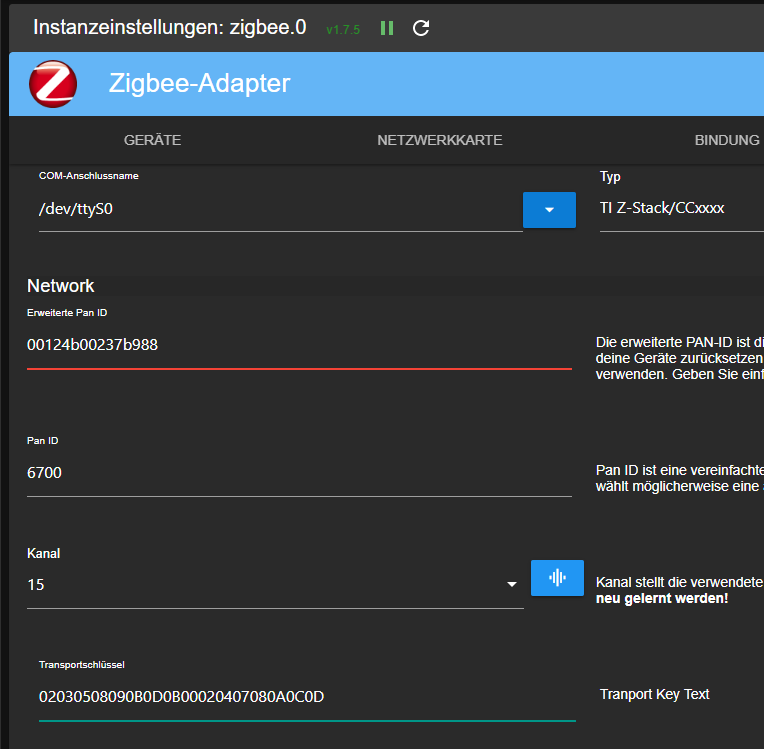

# Installation incl. moving from ioBroker/Zigbee adapter

The installation of the adapter as well as the relocation of the ioBrocker/Zigbee adapter requires some preliminary work. Here we describe the basic installation and its requirements. Detailed information, instructions and settings can be found on the page of [Zigbee2MQTT](https://www.zigbee2mqtt.io/guide/getting-started/).

## Installation

In our example, Zigbee2MQTT is set up via Docker / Docker Compose. More setup methods can be found on the official documentation. As a prerequisite here is a submitted Docker Server environment!

1. Edit the existing or new Docker-Compose.yml and add the following entry.
   It is important that these settings are adapted to your environment, e.g. the path to the USB antenna under "devices" or the path to the configuration file under "volumes".

    ```yml
    zigbee2mqtt:
        container_name: zigbee2mqtt
        restart: unless-stopped
        image: koenkk/zigbee2mqtt
        ports:
        - 8080:8080
        devices:
        - /dev/ttyUSB0:/dev//dev/ttyUSB0
        volumes:
        - /etc/localtime:/etc/localtime:ro
        - ./zigbee2mqtt/data:/app/data
        environment:
        - TZ=Europe/Berlin
    ```

2. Next, a standard configuration should be built.
   Here you can use the official or the optimized version for ioBroker.
   To do this, create the configuration.yaml file under ./zigbee2mqtt/data/.
   
   Original configuration:

   ```yml
   # Let new devices join our zigbee network
   permit_join: true
   # Docker-Compose makes the MQTT-Server available using "mqtt" hostname
   mqtt:
      base_topic: zigbee2mqtt
      server: mqtt://Your Data:Your Port (im normall Fall lautet der Port : 1885)
   # Zigbee Adapter path
   serial:
      port: /dev/ttyUSB0
   # Enable the Zigbee2MQTT frontend
   frontend:
      port: 8080
   advanced:
      pan_id: Your Data
      ext_pan_id: Your Data
      channel: Your Data
      network_key: Your Data
   ```

   For the adapter **optimized and recommended** version - values with "Your Data" must be adapted to your environment.

   ```yml
   homeassistant: false
   permit_join: true
   frontend:
      port: 8080
      host: 0.0.0.0
   mqtt:
      base_topic: zigbee2mqtt
      server: mqtt://Your Data:Your Port (in the normal case the port is : 1885)
   serial:
      port: /dev/ttyUSB0
   advanced:
      pan_id: Your Data
      ext_pan_id: Your Data
      channel: Your Data
      network_key: Your Data
      last_seen: ISO_8601_local
      homeassistant_legacy_entity_attributes: false
      legacy_api: false
      legacy_availability_payload: false
      cache_state: false
      output: json
      transmit_power: 20
      log_level: warn
   device_options:
      legacy: false
   availability: true
   ```
    Here is an example from the configuration of the Zigbee adapter in ioBroker and how this must be changed:

   

   ```yml
   mqtt:
      base_topic: zigbee2mqtt
      server: mqtt://192.168.1.1:1885 # ioBroker IP address with MQTT adapter or MQTT server see Zigbee2MQTT docu
   Serial:
      port: /dev/ttyACM0 #Path to the Zigbee antenna
   advanced:
      pan_id: 0x1A2C #PAN ID from ioBroker converted to Hex
      ext_pan_id: [0x00, 0x12, 0x4b, 0x02, 0x37, 0xb9, 0x88] #extended PAN ID from the ioBroker and in the notation [0xDD, 0xDD, 0xDD, 0xDD, 0xDD, 0xDD, 0xDD, 0xDD]
      channel: 15 #Channel from ioBroker
      network_key: [0x02, 0x03, 0x05, 0x08, 0x09, 0x0B, 0x0D, 0x0B, 0x00, 0x02, 0x04, 0x07, 0x08, 0x0A, 0x0C, 0x0D] # Network key/transport key and in the notation [0xDD, 0xDD, 0xDD, 0xDD, 0xDD, 0xDD, 0xDD, 0xDD]
   ```
   Please note that ONLY the PAN_ID has to be converted to HEX format.
   helpful is a Hex converter like this one: https://www.rapidtables.com/convert/number/hex-to-decimal.html.
   
    The remaining values are already in the correct format, they only have to be converted into the correct notation..     
   - so from ext_pan_id: 
   `00124b0237b988`     
   - to the ext_pan_id: 
   `0x00`, `0x12`, `0x4b`, `0x02`, `0x37`, `0xb9`, `0x88`
   
   this is exactly how the network_key must be recoded.
   
   This is important because otherwise the coordinator will receive wrong data and you will not be able to rebuild the network "just like that".

3. As can be seen, an MQTT server is required, which currently has no function for this adapter, but is     required for startup. For this purpose, one can be configured in the adapter in ioBroker or an additional Docker container (https://www.zigbee2mqtt.io/guide/getting-started/#_2-setup-and-start-zigbee2mqtt) can be used as in the original documentation.

4. Now you need to start preparing for the move. To do this, please proceed as following:
   - Delete all groups in the current Zigbee adapter. Unfortunately, these lead to various errors when importing the database. If you don't remove them here, you have to delete them manually from the database. This is time consuming and in case of errors the database is corrupt. A deletion of these groups in Zigbee2MQTT is unfortunately not possible.
   - Stop ioBroker/Zigbee Adpater
   - Copy the database from ioBroker to the container and rename it. 
   Source: /opt/iobroker/iobroker-data/zigbee_/shepart.db
   Destination: "Docker directory"/zigbee2mqtt/data/database.db


5. Once you have done all this, you can use `docker-compose up -d` to apply the Docker configuration and design the container.
   After a short time we can connect to the web interface of Zigbee2MQTT with http://Dockerhost-IP:8080. Also the configuration should have changed now and the hex values we entered should have been converted. If the webinterface should not come up/be accessible there is still an error and it will be shown in the log of the container to 99%.

6. Installation of the Zigbee2MQTT adapter via the adapter tab in ioBroker.

7. Configuration of the adapter See [Adapter configuration](./EN/EN_AdapterConfig.md)

8. If everything went well now, we have successfully converted our Zigbee network and we can still make a few adjustments to the new system.
   - Create deleted groups again
   - give devices a name
   - and last but not least we can adjust all scripts and other adapters that are used for certain states from the Zigbee network.
